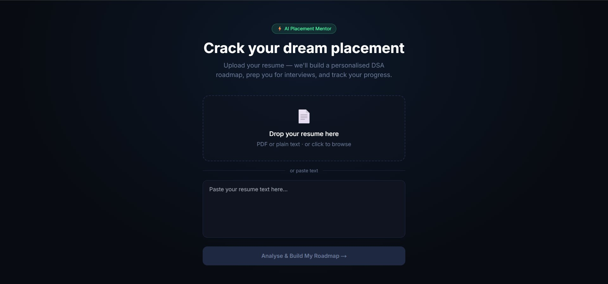
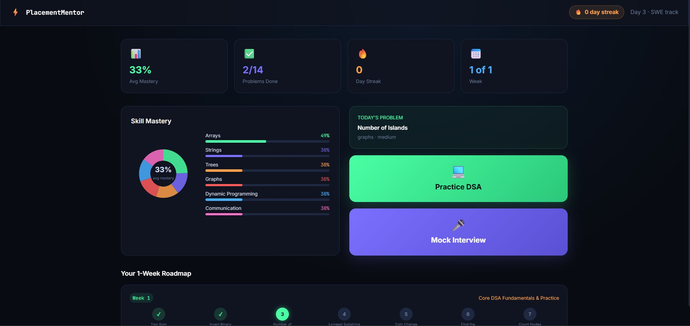
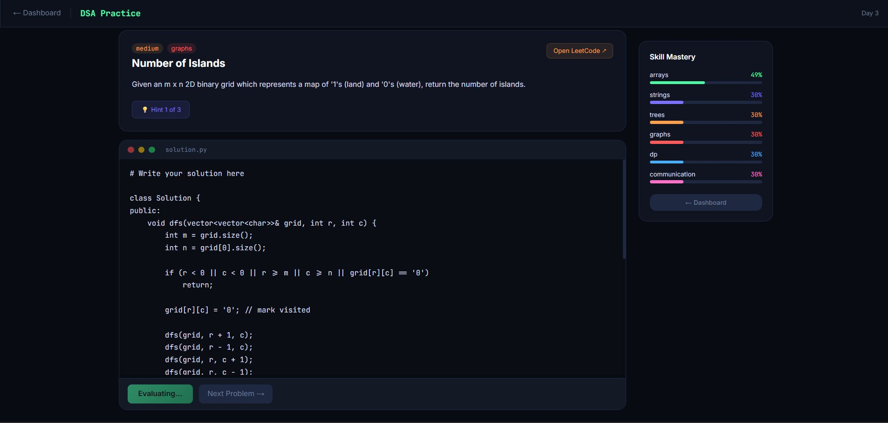
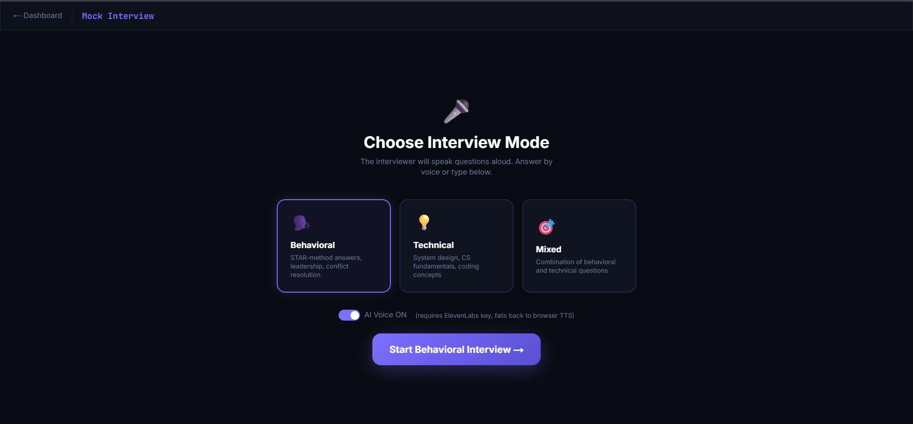
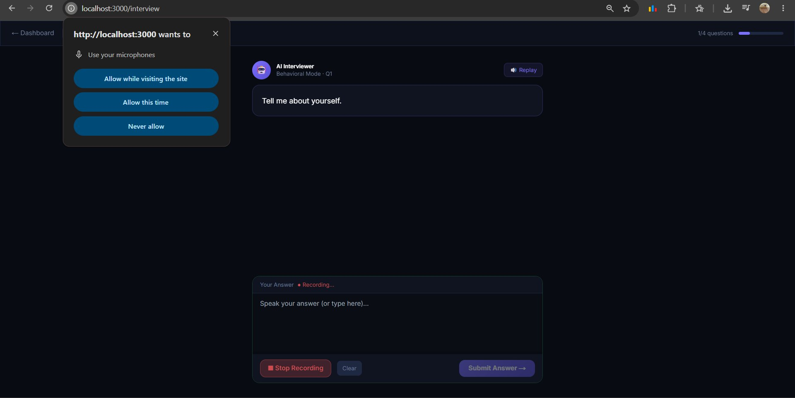

# 🧭 Placement Mentor — Agentic AI Placement Prep Platform (MVP)

> An AI-native, multi-agent mentor that diagnoses your skill gaps, builds a personalised DSA roadmap, runs mock interviews with voice, and adapts your plan as you progress — built with **LangGraph + FastAPI** and **Next.js + Tailwind**.

This is the **MVP** of a larger, production-grade platform (full design doc: [`docs/Agentic_Placement_Prep_Platform_Blueprint.md`](docs/Agentic_Placement_Prep_Platform_Blueprint.md)). It demonstrates the core agentic loop end-to-end with a single LLM provider, in-memory state, and a static problem bank — everything else in the blueprint builds outward from this skeleton.

---

## ✨ What it does

| Module | Description |
|---|---|
| **Resume-driven onboarding** | Paste/upload a resume → an agent extracts skills, estimates baseline skill mastery, and seeds the roadmap |
| **Adaptive roadmap** | A planning agent generates a day-by-day 1-week DSA roadmap from `skill_mastery`, grounded in real problems from the problem bank |
| **DSA practice workspace** | Daily auto-assigned problem, in-browser code editor, hint system (3 progressive levels), LLM-based code evaluation with verdict + complexity feedback |
| **Mock interviews (voice-enabled)** | 4-turn behavioral/technical/mixed interview, speech-to-text answers, AI voice questions (ElevenLabs → browser TTS fallback), structured end-of-interview report |
| **Skill mastery tracking** | Bayesian-Knowledge-Tracing-lite update after every DSA submission or interview — mastery scores drive the *next* roadmap |
| **Closed-loop re-planning** | Submitting code or finishing an interview updates `skill_mastery`, which visibly reshapes the next roadmap — this is the core "agentic" proof point |

---

## 📸 Screenshots

### Landing — Resume upload & onboarding


### Dashboard — Skill mastery, roadmap, and daily actions


### DSA Practice — Code editor, hints, mastery panel


### Mock Interview — Mode selection


### Mock Interview — Live voice session with AI interviewer


---

## 🏗️ Architecture

```
START → router (LLM intent classification)
              │ conditional edge (with session-state overrides)
   ┌──────────┼──────────────┬──────────────┐
   ▼          ▼               ▼              ▼
resume_agent dsa_agent  interview_agent  planning_agent
   │          │               │              │
   │          └──► update_mastery ◄──────────┘
   │                    │
   └────────────────────┴──► END
```

- **Router** — a single LLM call with structured output classifies user intent into `resume | dsa | interview | planning | general`.
- **Stateful routing override** (`agents/manager.py::route_after_router`) — if a mock interview is active, or the user is mid-DSA-problem, the conditional edge *bypasses the classifier* and routes straight back to that agent. This is what makes the system genuinely state-driven rather than a 4-way switch statement.
- **DSA agent** — primary path is a **zero-LLM lookup** (today's problem comes straight from the roadmap + problem bank). Fallback/evaluation paths use real tool-calling (`get_dsa_problem`, `evaluate_code`, `give_hint`) via `bind_tools`.
- **Interview agent** — a 4-turn behavioral/technical/mixed mock interview state machine that ends with a structured, scored report.
- **Planning agent** — generates a 1-week, day-by-day roadmap from `skill_mastery`, grounded to real `problem_id`s in `problems.json`.
- **update_mastery** — pure Python (no LLM): a Bayesian-Knowledge-Tracing-lite update to `skill_mastery` after a DSA submission or interview, and advances `current_day`. This node is the **feedback edge** that closes the loop back into the planning agent.
- **Persistence** — `MemorySaver` (LangGraph's in-memory checkpointer), keyed by a `thread_id` generated once per browser and stored in `localStorage`. State lives for the process lifetime — restarting the backend resets it (see *Known Limitations*).

### Tech stack

| Layer | Tech |
|---|---|
| Frontend | Next.js 14 (App Router), TailwindCSS |
| Backend | FastAPI |
| Agent orchestration | LangGraph (state machine, conditional routing, tool-calling) |
| LLM | Gemini 2.5 Flash (via `langchain-google-genai`) — provider-agnostic by design (`backend/llm.py`) |
| Voice | Browser Web Speech API (STT) + ElevenLabs TTS with browser `speechSynthesis` fallback |
| Resume parsing | `pypdf` |

---

## 🔁 Closed-loop demo (the core "agentic" proof)

1. Ask *"what's my plan for today?"* → planning agent generates a 1-week roadmap.
2. Ask *"give me today's problem"* → DSA agent presents Day 1's problem — **zero LLM calls**, pure lookup.
3. Paste a deliberately weak solution → `evaluate_code` tool runs, mastery for that topic shifts, `current_day` advances.
4. Ask *"what's my plan?"* again → the roadmap visibly re-prioritises toward the topic that just scored low.

---

## 🚀 Running locally

### Backend
```bash
cd backend
python -m venv .venv && source .venv/bin/activate   # Windows: .venv\Scripts\activate
pip install -r requirements.txt
cp .env.example .env   # paste your GOOGLE_API_KEY (Gemini) into .env
uvicorn main:app --reload --port 8000
```
Verify: `curl http://localhost:8000/` → `{"status":"ok"}`

### Frontend
```bash
cd frontend
npm install
cp .env.local.example .env.local   # NEXT_PUBLIC_API_URL=http://localhost:8000
npm run dev
```
Open [http://localhost:3000](http://localhost:3000)

---

## ☁️ Deployment

- **Frontend → Vercel** — import the repo, set the project root to `frontend/`, add env var `NEXT_PUBLIC_API_URL` pointing at your deployed backend.
- **Backend → Railway / Render / Fly.io** — deploy the `backend/` folder (`uvicorn main:app --host 0.0.0.0 --port $PORT`), set `GOOGLE_API_KEY` as an env var. Note: `MemorySaver` is in-memory, so state resets on restart/redeploy — acceptable for a demo, called out below as a known limitation.

---

## ⚠️ Known limitations (MVP scope)

This MVP intentionally trades persistence, scale, and breadth for a tight, demonstrable agentic loop. Everything below is **by design**, not oversight:

- **No database** — `MemorySaver` only; one user per browser session, reset on backend restart.
- **No auth** — implicit single user per `thread_id`.
- **No code execution sandbox** — `evaluate_code` is an LLM-based review, not a Judge0/Piston test runner.
- **No vector DB / RAG** — roadmap draws only from a static ~16-problem bank; no semantic problem search or curated learning-resource recommendations.
- **Single track (DSA-only)** — no Web Dev / ML / CS-fundamentals practice agents yet.
- **1-week roadmap horizon** — not the full multi-month, target-date-aware plan.
- **Resume input is plain text/PDF parse**, not a structured ATS-style analysis against a job description.
- Speech-to-text and TTS rely on browser/ElevenLabs APIs with no server-side voice pipeline.

---

## 🛣️ Roadmap to the full platform

This MVP is the **reference implementation of one Practice Agent (DSA) inside a Manager + specialist multi-agent architecture**. The full design — detailed in [`docs/Agentic_Placement_Prep_Platform_Blueprint.md`](docs/Agentic_Placement_Prep_Platform_Blueprint.md) — generalises this skeleton along several axes:

### 1. Persistence & multi-user
- Postgres + LangGraph Postgres checkpointer (replaces `MemorySaver`)
- Auth (JWT/OAuth2), real `user_profiles`, multi-device session resume

### 2. Native problem bank + real code execution
- Judge0/Piston sandbox for actual test-case execution, runtime, and complexity scoring
- Two-tier LeetCode integration: own problem bank + test suites for the core loop, plus **passive sync** of a user's public LeetCode/Codeforces stats as a secondary mastery signal and deep-link recommendations

### 3. More agents, same architecture (the *Track* abstraction)
- **Resume Agent** — full ATS-style JD matching, line-level suggestions, "claimed skill" verification loop
- **CS Fundamentals Agent** — RAG-grounded quizzes/explanations over OS/DBMS/CN/OOP
- **Web Dev / ML-Data Agents** — project-style and notebook-style practice tasks, implemented via a shared `PracticeAgent` interface so the Manager, Progress Tracking, and Planning agents need **zero changes** to support new tracks

### 4. Smarter progress & planning
- Proper Bayesian Knowledge Tracing / Elo-style mastery model
- Spaced repetition (FSRS/SM-2) for previously solved topics, with regression detection
- Multi-month, target-date-aware roadmaps with automatic re-planning (`replan_signal`) and human-readable rationale ("why this moved")

### 5. Richer mock interviews
- Separate *interviewer* and *evaluator* LLM personas to reduce scoring bias
- Company-style personas (e.g., leadership-principle-style follow-ups)
- System design interviews with live diagramming
- Full transcript storage + episodic memory recall ("how did I do in my last 3 mocks for company X?")

### 6. Resource curation & notifications
- Curated learning-resource library (videos/articles) per topic, retrieved via vector search — never LLM-hallucinated links
- Background workers (Celery/Arq) for spaced-repetition due-item scans, nightly mastery decay, and email/push reminders
- Calendar integration for scheduled mocks and study blocks

### 7. Observability & cost control
- LangSmith/Langfuse tracing of every agent run
- Lightweight intent-classifier model separate from the main reasoning model

> For the full reasoning behind each decision — including the multi-agent communication model, schema design, and screen-by-screen UX walkthroughs for the target product — see the complete blueprint in [`docs/Agentic_Placement_Prep_Platform_Blueprint.md`](docs/Agentic_Placement_Prep_Platform_Blueprint.md).

---

## 💡 Talking points

- **"Not everything goes through the LLM"** — the DSA agent's primary path is a pure lookup; the LLM is reserved for review/generation, which is faster and cheaper.
- The **stateful routing override** is the single piece of code that proves this is *agentic orchestration*, not "four chatbot tabs behind a router."
- **`update_mastery` is the closed loop** — DSA/interview outcomes feed back into the roadmap on the very next planning call, which is the heart of the "diagnose → plan → practice → evaluate → re-plan" product loop described in the full blueprint.
